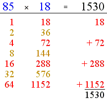

# Russian Peasent Multiplication Algorithm

Russian peasant multiplication (a.k.a ancient Egyptian multiplication) is a **systematic method for multiplying two numbers that does not require the multiplication table**, only the ability to multiply and divide by 2, and to add.

 

