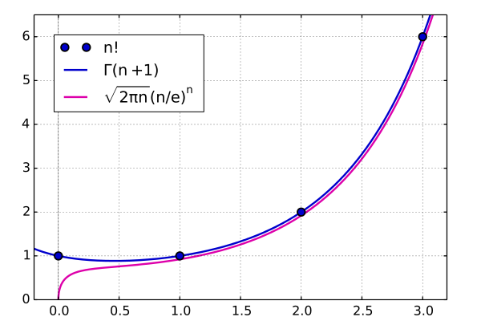

# Stirling's Approximation

Stirling's approximation (or Stirling's formula) is an **asymptotic approximation for factorials**. It is a good approximation, leading to accurate results even for small values of n.

